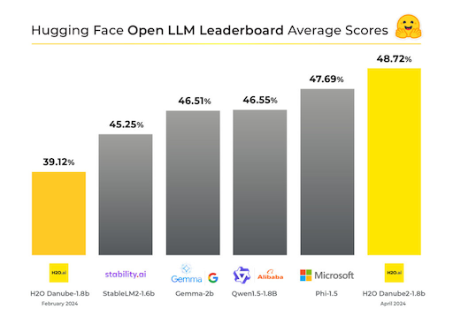

# Danube2 Quantization Notes

## Collection of Steps for Quantizing and Benchmarking Danube2

### Model

Danube2 with 1.8B parameters is the best in class, making it appropriate for many applications ranging from running on edge and mobile devices to low-latency specialized applications.

[H2O Danube2 1.8B Achieves Top Ranking on Hugging Face Open LLM Leaderboard for 2B Parameters Range](https://www.datanami.com/this-just-in/h2o-danube2-1-8b-achieves-top-ranking-on-hugging-face-open-llm-leaderboard-for-2b-parameters-range/)



The original HuggingFace repo can be found here: https://huggingface.co/h2oai/h2o-danube2-1.8b-base

The quantized chat version (the outcome of the below steps) is here: https://huggingface.co/aghorbani/h2o-danube2-1.8b-chat-gguf

In the following, I am noting the steps I have taken to produce the quantization for my own record, or for anyone who might find them useful.

## Quantization Process

Note: All commands were executed on a Mac M1.

I followed the instructions here: https://github.com/ggerganov/llama.cpp?tab=readme-ov-file#prepare-and-quantize


**Step 1: Download the Model**
```bash
git clone git@hf.co:h2oai/h2o-danube2-1.8b-chat
```

**Step 2: Convert to GGUF**
```bash
python convert.py ~/models/h2o-danube2-1.8b-chat --metadata ~/models/h2o-danube2-1.8b-chat-gguf/metadata.json --outtype f16
```

When you convert you can provide [metadata](https://huggingface.co/aghorbani/h2o-danube2-1.8b-chat-gguf/blob/main/metadata.json) as well.

**Step 3: Quantize**
```bash
./quantize ~/models/h2o-danube2-1.8b-chat/h2o-danube2-1.8b-chat-Q-v0-2B-F16.gguf ~/models/h2o-danube2-1.8b-chat/h2o-danube2-1.8b-chat-Q6_K.gguf Q6_K
```

**Step 4: Chat with the Quantized Model**

```bash
./main \
        -m ~/models/h2o-danube2-1.8b-chat-gguf/h2o-danube2-1.8b-chat-Q6_K.gguf  \
        -p "I am H2O-Danube, a conversational chat assistant developed by H2O.ai. <|prompt|>How are you?</s><|answer|>I am a helpful assistant, and I am here to assist you with any questions or tasks you may have. How can I help you today?</s><|prompt|>who are you?</s><|answer|>" \
        2>/dev/null
```

## Benchmarking

### Perplexity Evaluation

Download (and extract): https://huggingface.co/datasets/ggml-org/ci/resolve/main/wikitext-2-raw-v1.zip
```
./perplexity -m ~/models/h2o-danube2-1.8b-chat-gguf/h2o-danube2-1.8b-chat-Q4_K_M.gguf -f ./wikitext-2-raw/wiki.test.raw
```

| Model Type | Model Size | ms/token | tokens/sec | PPL |
|------------|------------|----------|------------|-----|
| F16        | 3.41 GiB   | 2.97     | 336.80     | 7.6882 +/- 0.04884 |
| Q8_0       | 1.81 GiB   | 3.06     | 327.25     | 7.6923 +/- 0.04888 |
| Q6_K       | 1.40 GiB   | 3.25     | 307.93     | 7.7014 +/- 0.04890 |
| Q5_KM      | 1.21 GiB   | 3.32     | 301.16     | 7.7843 +/- 0.04969 |
| Q4_KM      | 1.04       | 3.22     | 310.86     | 7.9240 +/- 0.05054 |

### MMLU Evaluation

To run the MMLU evaluation, I had some issues. It's still a work in progress (WIP). I have tried these steps though.


**Step 1: Serving the Quantize Model**

Serving `h2o-danube2-1.8b-chat-Q6_K.gguf` using [llama-cpp-python](https://github.com/abetlen/llama-cpp-python):

```bash
python -m llama_cpp.server --model ./h2o-danube2-1.8b-chat/h2o-danube2-1.8b-chat-Q6_K.gguf --n_ctx 8192  --logits_all true
```

You need `--logits_all true` for logprobs calculations. 
However, for GGUF models that don't add the `BOS` token, you might face issues: https://github.com/EleutherAI/lm-evaluation-harness/issues/1768
So, I had to apply this fix: https://github.com/abetlen/llama-cpp-python/pull/1471 before it works.

Then, I used [lm-evaluation-harness](https://github.com/EleutherAI/lm-evaluation-harness) to run the benchmark.

```
lm_eval --model gguf \
        --model_args base_url=http://localhost:8000 \
        --tasks mmlu \
        --output_path results/h2o-danube2-Q6_K \
        --num_fewshot 5 \
        --cache_requests true \
        --batch_size 4
```

For GGUF models, this is very, very slow (it was even slower on GPUs). I didn't dig much into it, so I gave up. I might work on it later.
